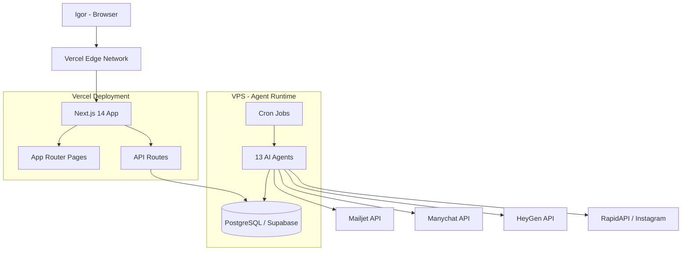

# Content Team AI Fullstack Architecture Document

**Date:** 2026-03-10
**Architect:** Igor Rocha
**Version:** 1.0
**Status:** Draft

---

## Introduction

This document outlines the complete fullstack architecture for Content Team AI, including backend systems, frontend implementation, and their integration. It serves as the single source of truth for AI-driven development, ensuring consistency across the entire technology stack.

### Starter Template or Existing Project

N/A - Greenfield project. Using standard Next.js 14 App Router with TypeScript as foundation.

### Change Log

| Date | Version | Description | Author |
|------|---------|-------------|--------|
| 2026-03-10 | 1.0 | Initial architecture | Igor Rocha |

---

## High Level Architecture

### Technical Summary

Content Team AI is a modular monolith built with Next.js 14 (App Router) serving both the frontend dashboard and backend API routes from a single deployment. The frontend uses Tailwind CSS with shadcn/ui components in a dark theme, while the backend connects directly to PostgreSQL via Supabase using the `pg` library (no ORM). Authentication uses a simple token-based system suitable for single-user access. The application deploys to Vercel's free tier, with AI agents running separately on an existing VPS via cron jobs communicating through a shared PostgreSQL task queue.

### Platform and Infrastructure Choice

**Platform:** Vercel + Supabase
**Key Services:** Vercel (hosting, serverless functions), Supabase (PostgreSQL, connection pooling)
**Deployment Host and Regions:** Vercel (auto, edge-optimized), Supabase us-east-1

### Repository Structure

**Structure:** Single monorepo (one Next.js project)
**Monorepo Tool:** N/A (single package)
**Package Organization:** Domain-organized within `src/` directory

### High Level Architecture Diagram



### Architectural Patterns

- **Modular Monolith:** Single Next.js app with domain-organized modules (content, crm, email, intelligence, agents, design, settings) - _Rationale:_ Simplest architecture for single developer, easy deployment, no inter-service communication overhead
- **Server Components + Client Components:** Use React Server Components for data fetching, Client Components for interactivity (drag-and-drop, forms) - _Rationale:_ Optimal performance with Next.js 14 App Router
- **Repository Pattern:** Abstract database queries into domain-specific query functions in `src/lib/queries/` - _Rationale:_ Testable, consistent data access without ORM overhead
- **Task Queue Pattern:** Agents communicate via `ct_tasks` PostgreSQL table instead of direct messaging - _Rationale:_ Reliable, persistent, auditable inter-agent communication without message broker complexity
- **Polling Pattern:** Dashboard refreshes via 30-second polling intervals - _Rationale:_ Much simpler than WebSocket, sufficient for single-user dashboard

---

## Tech Stack

### Technology Stack Table

| Category | Technology | Version | Purpose | Rationale |
|----------|-----------|---------|---------|-----------|
| Frontend Language | TypeScript | 5.5 | Type-safe development | Industry standard, catches errors at compile time |
| Frontend Framework | Next.js | 14 | App Router, SSR, API routes | Full-stack in one framework, Vercel-native |
| UI Component Library | shadcn/ui | latest | Pre-built accessible components | Customizable, dark theme support, Tailwind-native |
| State Management | React useState/useReducer | 18 | Local component state | No global state needed for single-user app |
| Backend Language | TypeScript | 5.5 | API route handlers | Same language as frontend, shared types |
| Backend Framework | Next.js API Routes | 14 | REST API endpoints | Built into Next.js, no separate server |
| API Style | REST | - | CRUD operations | Simple, well-understood, sufficient for this use case |
| Database | PostgreSQL | 15+ | Primary data store | Robust, Supabase-hosted, free tier |
| Cache | None | - | Not needed at this scale | Single user, < 1 req/sec |
| File Storage | Supabase Storage | - | Media files (future) | Integrated with database host |
| Authentication | Custom token | - | Single-user auth | Simplest solution for MVP |
| Frontend Testing | Jest + RTL | latest | Component tests | Standard React testing stack |
| Backend Testing | Jest | latest | API route tests | Consistent with frontend |
| E2E Testing | None (MVP) | - | Deferred | Low priority for single user |
| Build Tool | Next.js | 14 | Build and bundle | Built-in with framework |
| CSS Framework | Tailwind CSS | 3.4 | Utility-first styling | Fast development, dark theme |
| Icons | Lucide React | 0.400 | UI icons | Consistent, tree-shakeable |
| Validation | Zod | 3.23 | Input validation | TypeScript-native, runtime validation |

---

## Data Models

### Agent

**Purpose:** Represents one of the 13 AI content team agents.

**Key Attributes:**
- id: UUID - Primary key
- slug: string - Unique identifier (e.g., "content-director")
- display_name: string - Human-readable name
- role: string - Agent's role description
- status: "idle" | "active" | "error" - Current state
- last_active_at: timestamp - Last activity time
- config: JSONB - Agent-specific configuration

```typescript
interface Agent {
  id: string
  slug: string
  display_name: string
  role: string
  status: "idle" | "active" | "error"
  last_active_at: string | null
  config: Record<string, unknown>
  created_at: string
}
```

### ContentItem

**Purpose:** A piece of content (post, carousel, video, email) in the pipeline.

**Key Attributes:**
- id: UUID - Primary key
- title: string - Content title
- content_type: string - Type (post/carousel/video/story/email)
- status: string - Pipeline status (idea/draft/review/approved/published)
- platform: string - Target platform
- scheduled_at: timestamp - When to publish
- approval_status: string - Review status (pending/approved/rejected)

```typescript
interface ContentItem {
  id: string
  title: string
  content_type: string
  status: "idea" | "draft" | "review" | "approved" | "published"
  platform: "instagram" | "youtube" | "linkedin" | "x" | "email"
  scheduled_at: string | null
  published_at: string | null
  caption: string | null
  hashtags: string[]
  script: string | null
  visual_notes: string | null
  media_urls: string[]
  source_agent: string | null
  approval_status: "pending" | "approved" | "rejected"
  approval_notes: string | null
  engagement: Record<string, unknown> | null
  created_at: string
  updated_at: string
}
```

### Task

**Purpose:** Task queue for inter-agent communication.

```typescript
interface Task {
  id: string
  title: string
  description: string | null
  assigned_agent: string | null
  created_by: string | null
  status: "pending" | "in_progress" | "completed" | "cancelled" | "failed"
  priority: number
  due_at: string | null
  completed_at: string | null
  result: Record<string, unknown> | null
  parent_task_id: string | null
  metadata: Record<string, unknown>
  created_at: string
  updated_at: string
}
```

### Deal

**Purpose:** CRM deal/opportunity in the sales pipeline.

```typescript
interface Deal {
  id: string
  contact_id: string
  title: string
  value: number | null
  currency: string
  stage_id: string
  status: "open" | "won" | "lost"
  expected_close_at: string | null
  notes: string | null
  created_at: string
  updated_at: string
}
```

**Full type definitions:** See `src/lib/types.ts` for all 18 entity interfaces.

---

## API Specification

### REST API Specification

```yaml
openapi: 3.0.0
info:
  title: Content Team AI API
  version: 1.0.0
  description: REST API for Content Team AI dashboard
servers:
  - url: /api
    description: Next.js API routes

paths:
  /api/agents:
    get:
      summary: List all agents with task counts
      responses:
        200:
          description: Array of agents with pending task count

  /api/agents/{slug}:
    get:
      summary: Get agent details with recent tasks
      parameters:
        - name: slug
          in: path
          required: true

  /api/content:
    get:
      summary: List content items with filters
      parameters:
        - name: status
          in: query
        - name: platform
          in: query
        - name: type
          in: query
        - name: from
          in: query
          description: Date range start (for calendar)
        - name: to
          in: query
          description: Date range end
        - name: page
          in: query
        - name: limit
          in: query
    post:
      summary: Create content item

  /api/content/{id}:
    get:
      summary: Get content detail
    patch:
      summary: Update content (reschedule, approve, reject)
    delete:
      summary: Delete content item

  /api/pipeline/stages:
    get:
      summary: List pipeline stages with deal counts

  /api/pipeline/deals:
    get:
      summary: List deals with filters
    post:
      summary: Create deal

  /api/pipeline/deals/{id}:
    patch:
      summary: Update deal (move stage, edit details)

  /api/contacts:
    get:
      summary: List contacts with search/filter
    post:
      summary: Create contact

  /api/contacts/{id}:
    get:
      summary: Get contact with deals and activities
    patch:
      summary: Update contact
    delete:
      summary: Delete contact

  /api/subscribers:
    get:
      summary: List subscribers with tag filter
    post:
      summary: Add subscriber

  /api/campaigns:
    get:
      summary: List email campaigns
    post:
      summary: Create campaign

  /api/campaigns/{id}:
    get:
      summary: Get campaign details with stats
    patch:
      summary: Update campaign
    post:
      summary: Send campaign (triggers Mailjet)

  /api/competitors:
    get:
      summary: List competitors with latest posts

  /api/competitors/{id}/posts:
    get:
      summary: Get competitor posts with engagement

  /api/influencers:
    get:
      summary: List influencers
    post:
      summary: Add influencer

  /api/influencers/{id}:
    patch:
      summary: Update influencer

  /api/design-system:
    get:
      summary: Get current design system
    patch:
      summary: Update design system

  /api/settings:
    get:
      summary: Get settings (API keys masked, cron schedules)
    patch:
      summary: Update settings

  /api/stats:
    get:
      summary: Get dashboard overview stats
```

---

## Components

### Sidebar Navigation Component

**Responsibility:** Persistent navigation sidebar with links to all 13 pages.
**Key Interfaces:** Active route detection, collapse/expand state, mobile hamburger menu.
**Dependencies:** Next.js `usePathname`, Lucide icons.
**Technology:** Client Component (interactive state).

### Dashboard Stats Cards

**Responsibility:** Display 4 key metric cards on overview page.
**Key Interfaces:** Fetches from `/api/stats`.
**Dependencies:** Server Component with polling refresh.

### Agent Status Grid

**Responsibility:** Display 13 agent cards with real-time status.
**Key Interfaces:** Fetches from `/api/agents`, 30s polling.
**Dependencies:** StatusBadge component.

### Content Calendar

**Responsibility:** Month/week calendar view with drag-and-drop.
**Key Interfaces:** Fetches content by date range, PATCH to reschedule.
**Dependencies:** Custom calendar grid (no heavy library), Client Component.

### Kanban Board

**Responsibility:** CRM pipeline with drag-and-drop deal cards.
**Key Interfaces:** Fetches stages + deals, PATCH to move deals.
**Dependencies:** Client Component with drag handlers.

### Data Table

**Responsibility:** Reusable filterable/sortable table for contacts, subscribers, content list, influencers.
**Key Interfaces:** Generic props for columns, data, filters, pagination.
**Dependencies:** shadcn/ui Table, Client Component for filters.

### Content Preview

**Responsibility:** Display content detail with approve/reject actions.
**Key Interfaces:** Content item data, approval handlers.
**Dependencies:** shadcn/ui Card, Dialog, Button.

### Design System Editor

**Responsibility:** Edit brand colors, fonts, carousel style with live preview.
**Key Interfaces:** PATCH to `/api/design-system`, color picker, font selector.
**Dependencies:** Client Component, color input, preview renderer.

---

## External APIs

### Mailjet API

- **Purpose:** Send email campaigns and manage subscribers
- **Documentation:** https://dev.mailjet.com/
- **Base URL:** https://api.mailjet.com/v3.1
- **Authentication:** Basic Auth (API Key + Secret)
- **Rate Limits:** 200 emails/hour (free tier), 6000 emails/month
- **Key Endpoints Used:**
  - `POST /send` - Send email campaigns
  - `GET /contact` - List/manage contacts
- **Integration Notes:** Used by audience-director agent on VPS, not by dashboard directly.

### Manychat API

- **Purpose:** Social DM automation and welcome sequences
- **Documentation:** https://api.manychat.com/
- **Base URL:** https://api.manychat.com/fb
- **Authentication:** Bearer token
- **Rate Limits:** Per Manychat Business plan
- **Key Endpoints Used:**
  - `POST /sending/sendContent` - Send messages
  - `GET /subscriber/getInfo` - Get subscriber data
- **Integration Notes:** Used by listening-director agent on VPS only.

### HeyGen API

- **Purpose:** Generate avatar videos from scripts
- **Documentation:** https://docs.heygen.com/
- **Base URL:** https://api.heygen.com/v2
- **Authentication:** API Key header
- **Rate Limits:** Pay-as-you-go
- **Key Endpoints Used:**
  - `POST /video/generate` - Create video from script
  - `GET /video/{id}` - Check video status
- **Integration Notes:** Used by clone-agent on VPS only.

### RapidAPI (Instagram)

- **Purpose:** Scrape competitor Instagram profiles and posts
- **Base URL:** Varies by provider
- **Authentication:** RapidAPI key header
- **Key Endpoints Used:**
  - Profile info endpoint
  - Recent posts endpoint
- **Integration Notes:** Used by content-searcher agent on VPS via daily cron.

---

## Database Schema

Full SQL schema in `supabase/migrations/001_content_team.sql`. Key design decisions:

- **18 tables** with `ct_` prefix to avoid conflicts with other schemas
- **UUID primary keys** (gen_random_uuid) for all tables
- **JSONB columns** for flexible metadata (agent config, engagement stats, etc.)
- **TEXT[] arrays** for tags, hashtags, media URLs
- **Proper indexes** on status, agent, platform, stage, scheduled_at columns
- **Foreign keys** with referential integrity
- **Seed data:** 13 agents, 6 pipeline stages, 8 competitors, design system defaults

---

## Frontend Architecture

### Component Architecture

```
src/
├── app/                          # Next.js App Router
│   ├── layout.tsx                # Root layout (dark theme, font)
│   ├── page.tsx                  # / Overview dashboard
│   ├── login/page.tsx            # Login page
│   ├── calendar/page.tsx         # Content calendar
│   ├── content/
│   │   ├── page.tsx              # Content list
│   │   └── [id]/page.tsx         # Content detail
│   ├── agents/page.tsx           # Agent monitoring
│   ├── pipeline/page.tsx         # CRM Kanban
│   ├── contacts/page.tsx         # Contact list
│   ├── subscribers/page.tsx      # Subscriber list
│   ├── campaigns/page.tsx        # Campaign list
│   ├── competitors/page.tsx      # Competitor dashboard
│   ├── influencers/page.tsx      # Influencer list
│   ├── design/page.tsx           # Design system editor
│   ├── settings/page.tsx         # Settings
│   └── api/                      # API routes
│       ├── agents/route.ts
│       ├── content/route.ts
│       ├── content/[id]/route.ts
│       ├── pipeline/
│       │   ├── stages/route.ts
│       │   └── deals/route.ts
│       ├── contacts/route.ts
│       ├── subscribers/route.ts
│       ├── campaigns/route.ts
│       ├── competitors/route.ts
│       ├── influencers/route.ts
│       ├── design-system/route.ts
│       ├── settings/route.ts
│       └── stats/route.ts
├── components/
│   ├── ui/                       # shadcn/ui components
│   ├── layout/
│   │   ├── sidebar.tsx           # Main sidebar navigation
│   │   └── header.tsx            # Page header with breadcrumbs
│   ├── dashboard/
│   │   ├── stat-card.tsx
│   │   ├── agent-grid.tsx
│   │   └── upcoming-content.tsx
│   ├── calendar/
│   │   └── content-calendar.tsx
│   ├── content/
│   │   ├── content-table.tsx
│   │   └── content-preview.tsx
│   ├── pipeline/
│   │   ├── kanban-board.tsx
│   │   └── deal-card.tsx
│   ├── agents/
│   │   └── agent-card.tsx
│   └── shared/
│       ├── data-table.tsx        # Reusable filtered table
│       ├── status-badge.tsx      # Status indicator
│       └── polling-wrapper.tsx   # 30s polling HOC
└── lib/
    ├── db.ts                     # PostgreSQL connection pool
    ├── types.ts                  # All TypeScript interfaces
    ├── utils.ts                  # Utility functions (cn, formatters)
    ├── design-system.ts          # Design token exports
    └── queries/                  # Database query functions
        ├── agents.ts
        ├── content.ts
        ├── pipeline.ts
        ├── contacts.ts
        ├── subscribers.ts
        ├── campaigns.ts
        ├── competitors.ts
        ├── influencers.ts
        └── stats.ts
```

### State Management Architecture

No global state management library needed. Patterns:
- **Server Components** fetch data directly from database queries
- **Client Components** use `useState` for local UI state (filters, modals, drag state)
- **Polling** via `useEffect` + `setInterval` at 30s for real-time-ish updates
- **Optimistic updates** for drag-and-drop (update UI immediately, PATCH in background)

### Routing Architecture

Next.js 14 App Router with file-based routing. All pages under `src/app/`.

```typescript
// Protected route pattern via middleware
// src/middleware.ts
import { NextRequest, NextResponse } from 'next/server'

export function middleware(request: NextRequest) {
  const token = request.cookies.get('auth-token')?.value
  if (!token && !request.nextUrl.pathname.startsWith('/login')) {
    return NextResponse.redirect(new URL('/login', request.url))
  }
}

export const config = {
  matcher: ['/((?!_next/static|_next/image|favicon.ico).*)']
}
```

### Frontend Services Layer

API calls from Client Components use standard fetch:

```typescript
// src/lib/api.ts
const API_BASE = '/api'

async function apiCall<T>(path: string, options?: RequestInit): Promise<T> {
  const res = await fetch(`${API_BASE}${path}`, {
    ...options,
    headers: {
      'Content-Type': 'application/json',
      ...options?.headers,
    },
  })
  if (!res.ok) {
    const error = await res.json()
    throw new Error(error.message || 'API error')
  }
  return res.json()
}

export const api = {
  agents: {
    list: () => apiCall<Agent[]>('/agents'),
    get: (slug: string) => apiCall<AgentDetail>(`/agents/${slug}`),
  },
  content: {
    list: (params?: ContentFilters) => apiCall<ContentItem[]>(`/content?${new URLSearchParams(params as any)}`),
    get: (id: string) => apiCall<ContentItem>(`/content/${id}`),
    update: (id: string, data: Partial<ContentItem>) => apiCall<ContentItem>(`/content/${id}`, { method: 'PATCH', body: JSON.stringify(data) }),
  },
  // ... same pattern for all resources
}
```

---

## Backend Architecture

### Service Architecture (API Routes)

Each API route follows the same pattern:

```typescript
// src/app/api/agents/route.ts
import { NextRequest, NextResponse } from 'next/server'
import { query } from '@/lib/db'

export async function GET(request: NextRequest) {
  try {
    const { rows } = await query(`
      SELECT a.*,
        (SELECT COUNT(*) FROM ct_tasks WHERE assigned_agent = a.slug AND status = 'pending') as pending_tasks
      FROM ct_agents a
      ORDER BY a.status DESC, a.display_name
    `)
    return NextResponse.json(rows)
  } catch (error) {
    console.error('GET /api/agents error:', error)
    return NextResponse.json({ message: 'Internal server error' }, { status: 500 })
  }
}
```

### Database Architecture

Direct SQL via `pg` library. Query functions organized by domain in `src/lib/queries/`:

```typescript
// src/lib/queries/agents.ts
import { query } from '@/lib/db'
import type { Agent } from '@/lib/types'

export async function listAgents(): Promise<Agent[]> {
  const { rows } = await query<Agent>('SELECT * FROM ct_agents ORDER BY display_name')
  return rows
}

export async function getAgentWithTasks(slug: string) {
  const agent = await query<Agent>('SELECT * FROM ct_agents WHERE slug = $1', [slug])
  const tasks = await query('SELECT * FROM ct_tasks WHERE assigned_agent = $1 ORDER BY created_at DESC LIMIT 20', [slug])
  return { agent: agent.rows[0], tasks: tasks.rows }
}
```

### Authentication and Authorization

Simple token-based auth for single user:

```typescript
// src/lib/auth.ts
export function validateToken(token: string): boolean {
  return token === process.env.AUTH_TOKEN
}
```

Middleware checks cookie on all routes except `/login` and `/api/health`.

---

## Unified Project Structure

```
content-team-ai/
├── .github/
│   └── workflows/
│       └── ci.yaml                 # Type check + lint on push
├── bmad/
│   └── config.yaml                 # BMAD project config
├── docs/
│   ├── brief.md                    # Product Brief
│   ├── prd.md                      # PRD
│   ├── architecture.md             # This document
│   ├── project-context.md          # Project context
│   ├── sprint-plan.md              # Sprint plan
│   ├── sprint-status.yaml          # Sprint tracking
│   ├── bmm-workflow-status.yaml    # BMAD workflow status
│   └── stories/                    # Individual story docs
├── src/
│   ├── app/                        # Next.js App Router (pages + API)
│   ├── components/                 # React components
│   └── lib/                        # Shared utilities, types, queries
├── supabase/
│   └── migrations/
│       └── 001_content_team.sql    # Database schema
├── public/                         # Static assets
├── package.json
├── tsconfig.json
├── tailwind.config.ts
├── postcss.config.js
├── next.config.js
├── .env.example
├── .gitignore
└── README.md
```

---

## Development Workflow

### Local Development Setup

```bash
# Prerequisites
node --version  # v18+
npm --version   # v9+

# Initial Setup
git clone https://github.com/AIgorrocha/content-team-ai.git
cd content-team-ai
npm install
cp .env.example .env.local
# Edit .env.local with your Supabase connection string and auth token

# Development Commands
npm run dev          # Start Next.js dev server (http://localhost:3000)
npm run build        # Production build
npm run lint         # ESLint check
npm run type-check   # TypeScript check
```

### Environment Configuration

```bash
# .env.local
DATABASE_URL=postgresql://postgres:[PASSWORD]@[HOST]:5432/postgres
AUTH_TOKEN=your-secret-token-here
MAILJET_API_KEY=     # Only needed for email features
MAILJET_SECRET_KEY=
```

---

## Deployment Architecture

### Deployment Strategy

**Frontend + Backend Deployment:**
- **Platform:** Vercel (free tier)
- **Build Command:** `npm run build`
- **Output:** `.next/` (automatic)
- **CDN/Edge:** Vercel Edge Network (automatic)
- **Environment Variables:** Set in Vercel dashboard

**Agent Deployment (separate):**
- **Platform:** Existing VPS (100.74.74.90)
- **Runtime:** Node.js cron jobs
- **Deployment:** Manual via SSH/SFTP

### Environments

| Environment | URL | Purpose |
|-------------|-----|---------|
| Development | http://localhost:3000 | Local development |
| Production | content-team-ai.vercel.app | Live dashboard |

---

## Security and Performance

### Security Requirements

**Frontend Security:**
- CSP Headers: Default Vercel headers
- XSS Prevention: React's built-in escaping
- Secure Storage: Auth token in httpOnly cookie

**Backend Security:**
- Input Validation: Zod schemas on all POST/PATCH routes
- Rate Limiting: Vercel's built-in (100 req/s free tier)
- CORS Policy: Same-origin (frontend and API on same domain)

**Authentication Security:**
- Token Storage: httpOnly, secure, sameSite cookie
- Session Management: Stateless (token validation per request)

### Performance Optimization

**Frontend Performance:**
- Bundle Size Target: < 200KB initial JS
- Loading Strategy: React Server Components for static parts, Client Components only for interactivity
- Caching Strategy: ISR for slow-changing data, SWR for polling

**Backend Performance:**
- Response Time Target: < 500ms for all API routes
- Database Optimization: Proper indexes on all query columns
- Connection Pooling: pg Pool with max 10 connections

---

## Testing Strategy

### Testing Pyramid

```
          E2E Tests (future)
         /                 \
    Integration Tests (API routes)
       /                     \
  Component Tests        Query Tests
```

### Test Organization

```
src/
├── __tests__/
│   ├── api/              # API route tests
│   │   ├── agents.test.ts
│   │   └── content.test.ts
│   ├── components/       # Component tests
│   │   ├── sidebar.test.tsx
│   │   └── stat-card.test.tsx
│   └── lib/              # Utility tests
│       ├── queries.test.ts
│       └── utils.test.ts
```

---

## Coding Standards

### Critical Fullstack Rules

- **Type Sharing:** All entity types defined in `src/lib/types.ts` and imported everywhere
- **API Calls:** Client Components use `src/lib/api.ts` service layer, never raw fetch
- **Environment Variables:** Access only through typed config, never `process.env` directly in components
- **Error Handling:** All API routes use try/catch with consistent error response format
- **State Updates:** Never mutate state directly - always create new objects
- **SQL Queries:** Always use parameterized queries ($1, $2...) - never string interpolation
- **Dark Theme:** All components use Tailwind theme classes, never hardcoded colors

### Naming Conventions

| Element | Convention | Example |
|---------|-----------|---------|
| Components | PascalCase | `AgentCard.tsx` |
| Hooks | camelCase with 'use' | `usePolling.ts` |
| API Routes | kebab-case in URL | `/api/design-system` |
| Database Tables | snake_case with ct_ prefix | `ct_content_items` |
| Query Functions | camelCase | `listAgents()` |
| Types | PascalCase | `ContentItem` |

---

## Error Handling Strategy

### Error Response Format

```typescript
interface ApiError {
  message: string
  code?: string
  details?: Record<string, unknown>
}
```

### API Error Pattern

```typescript
// Standard error handler for API routes
export function apiError(message: string, status: number) {
  return NextResponse.json({ message }, { status })
}

// Usage in routes
if (!id) return apiError('Missing id parameter', 400)
if (!result.rows[0]) return apiError('Not found', 404)
```

---

## Monitoring and Observability

### Monitoring Stack

- **Frontend Monitoring:** Vercel Analytics (free, built-in)
- **Backend Monitoring:** Vercel Function logs
- **Error Tracking:** Console errors in Vercel logs (upgrade to Sentry later)
- **Database Monitoring:** Supabase dashboard

### Key Metrics

**Frontend:** Page load time, JavaScript errors, Core Web Vitals (via Vercel)
**Backend:** API response times, error rates (via Vercel Function logs)
**Database:** Query performance, connection count (via Supabase dashboard)
